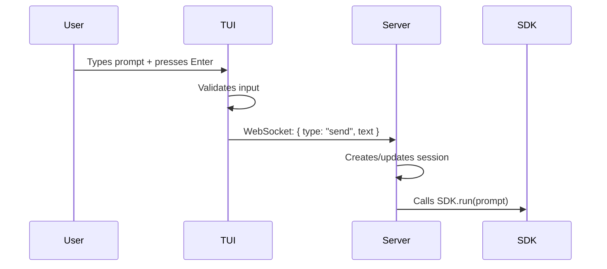
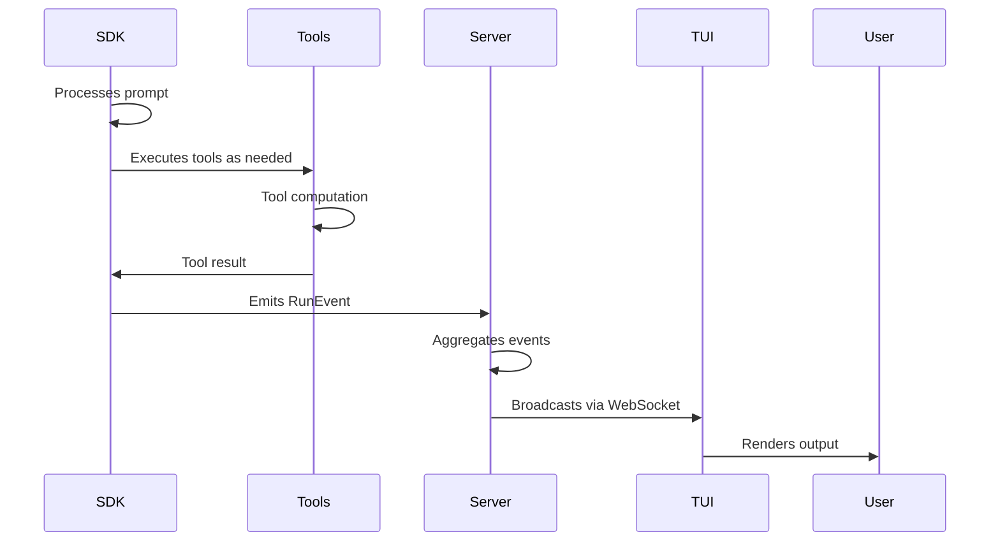

# Architecture Overview

MixCode is built on a three-tier architecture: TUI frontend, Node.js backend, and agent SDKs.

## System Architecture

```
┌────────────────────────────────────────┐
│        MixCode TUI (React + Bun)       │
│   - User input handling                │
│   - Session browsing                   │
│   - Event rendering                    │
└────────────────────┬───────────────────┘
                     │
              WebSocket (ws)
                 JSON Events
                     │
┌────────────────────▼───────────────────┐
│   Backend Server (Node + Hono)         │
│   - WebSocket handling                 │
│   - Session management                 │
│   - Runner orchestration               │
│   - Event aggregation                  │
└────────┬──────────────────┬────────────┘
         │                  │
    ┌────▼─────┐       ┌────▼──────┐
    │ Claude   │       │ Codex SDK │
    │ SDK      │       │            │
    └──────────┘       └────────────┘
         │                  │
    ┌────▼──────────────────▼─┐
    │  Tool Execution Layer   │
    │  (MCP Servers, APIs)    │
    └────────────────────────┘
```

## Core Components

### 1. TUI (Terminal User Interface)

**Location:** `/tui`  
**Technology:** Bun + React + @opentui/react  
**Responsibility:** User interaction and visual rendering

```
tui/
├── src/
│   ├── index.tsx           # Entry point
│   ├── app.tsx             # Main layout component
│   ├── api/ws.ts           # WebSocket client
│   ├── state/              # React hooks & state
│   │   ├── useSession.ts
│   │   ├── useHistory.ts
│   │   └── useCompletion.ts
│   ├── components/         # UI components
│   │   ├── Header.tsx
│   │   ├── Sidebar.tsx
│   │   ├── Transcript.tsx
│   │   ├── ToolCard.tsx
│   │   ├── Prompt.tsx
│   │   └── StatusBar.tsx
│   └── util/               # Utilities
│       ├── format.ts
│       ├── fuzzy.ts
│       ├── files.ts
│       └── slash.ts
```

**Key Responsibilities:**
- Render terminal UI using React
- Connect to backend via WebSocket
- Manage user input (prompts, commands)
- Display events and tool outputs in real-time
- Handle session navigation

### 2. Backend Server

**Location:** `/server`  
**Technology:** Node.js + Hono + WebSocket  
**Responsibility:** Session management and agent orchestration

```
server/src/
├── index.ts                # Hono app & WebSocket handler
├── sessions.ts             # Session manager
├── transcript.ts           # Event storage
├── permissions.ts          # Permission system
├── runners/
│   ├── claude.ts          # Claude SDK adapter
│   ├── codex.ts           # Codex SDK adapter
│   ├── delegate.ts        # Delegation/MCP support
│   └── validate.ts        # Validation runner
└── orchestrator/
    ├── tasks.ts           # Task management
    └── subtasks.ts        # Subtask handling
```

**Key Responsibilities:**
- Accept WebSocket connections from TUI
- Route client messages to appropriate runner
- Maintain session state and continuity
- Stream events back to clients
- Manage tool execution and MCP servers

### 3. Shared Protocol

**Location:** `/shared`  
**File:** `events.ts`  
**Responsibility:** Type definitions for WebSocket communication

```typescript
// Client -> Server
type ClientMsg = 
  | { type: "send"; sessionId: string; text: string }
  | { type: "cancel"; sessionId: string }

// Server -> Client
type ServerMsg =
  | { type: "event"; sessionId: string; event: RunEvent }
  | { type: "error"; sessionId: string; message: string }

// Run events from SDK
type RunEvent =
  | { type: "text_delta"; delta: string }
  | { type: "tool_log"; tool: string; output: string }
  | { type: "usage"; tokens: UsageData }
  | { type: "error"; message: string }
```

## Data Flow

### 1. User Sends a Prompt



### 2. SDK Processes Request



### 3. Event Broadcasting

All connected clients receive the same event stream:

```
Server maintains:
├── Active sessions
├── SDK instances
└── Event listeners

Each RunEvent:
1. Generated by SDK
2. Formatted as ServerMsg
3. Broadcast to all clients for that session
4. Rendered immediately in TUI
```

## Session Management

### Session Lifecycle

```
1. NEW SESSION
   │
   ├─→ Session created in memory
   │
   ├─→ SDK instance initialized (Claude or Codex)
   │
   ├─→ Session ID assigned
   │
   ├─→ Transcript file created
   │
   └─→ Ready for messages

2. ACTIVE SESSION
   │
   ├─→ Receives ClientMsg
   │
   ├─→ Routes to active runner
   │
   ├─→ Emits RunEvents
   │
   ├─→ Stores in transcript
   │
   └─→ Broadcasts to all clients

3. SESSION SWITCH
   │
   ├─→ Keep session in memory
   │
   ├─→ Preserve SDK continuity
   │
   ├─→ Switch active runner
   │
   └─→ Next message uses new runner

4. SESSION DELETION
   │
   ├─→ Remove from memory
   │
   ├─→ Keep transcript file
   │
   └─→ Cleanup resources
```

### Per-Project Scoping (mixcode command)

When using the global `mixcode` command:

```
~/.mixcode/
└── projects/
    ├── <encoded-pwd-1>/
    │   ├── server.log
    │   ├── sessions.json
    │   ├── transcripts/
    │   ├── .env
    │   └── port: 4567
    │
    └── <encoded-pwd-2>/
        ├── server.log
        ├── sessions.json
        ├── transcripts/
        ├── .env
        └── port: 4568
```

Each directory gets:
- **Isolated port** to avoid conflicts
- **Separate sessions** and history
- **Project-specific .env** file
- **Dedicated log file**

## Runner System

### Runner Interface

Both Claude and Codex implement a common runner interface:

```typescript
interface Runner {
  sessionId: string | null
  run(prompt: string, onEvent: (event: RunEvent) => void): Promise<void>
  cancel(): void
}
```

### Claude Runner

- Uses `@anthropic-ai/claude-agent-sdk`
- Manages Claude session continuity
- Implements tool execution with MCP
- Streams events for real-time rendering

### Codex Runner

- Uses OpenAI Codex API
- Manages conversation history
- Implements function calling
- Streams events for consistency

## WebSocket Protocol

### Connection Flow

```
TUI → Server Connection (ws://127.0.0.1:4567/ws)
      │
      ├─ Connect
      │
      ├─ Ready to receive ClientMsg
      │
      └─ Start broadcasting ServerMsg
```

### Message Format

**Client to Server:**

```json
{
  "type": "send",
  "sessionId": "sess_xyz",
  "text": "Build me a function"
}
```

**Server to Client:**

```json
{
  "type": "event",
  "sessionId": "sess_xyz",
  "event": {
    "type": "text_delta",
    "delta": "Here's a function"
  }
}
```

## Folder Structure Explained

```
adverserial-code/
│
├── shared/
│   └── events.ts              # Protocol types
│
├── server/
│   ├── package.json           # Server dependencies
│   ├── tsconfig.json
│   └── src/
│       ├── index.ts           # Hono server + WebSocket
│       ├── sessions.ts        # Session manager
│       ├── transcript.ts      # Event persistence
│       ├── permissions.ts     # Permission system
│       ├── runners/           # SDK adapters
│       │   ├── claude.ts
│       │   ├── codex.ts
│       │   ├── delegate.ts    # MCP delegation
│       │   └── validate.ts    # Validation
│       └── orchestrator/      # Task management
│           ├── tasks.ts
│           └── subtasks.ts
│
├── tui/
│   ├── package.json           # TUI dependencies
│   ├── bunfig.toml           # Bun config
│   └── src/
│       ├── index.tsx          # React entry
│       ├── app.tsx            # Main layout
│       ├── api/ws.ts          # WebSocket client
│       ├── state/             # React hooks
│       ├── components/        # UI components
│       └── util/              # Utilities
│
├── bin/
│   ├── start.mjs              # npm start launcher
│   └── mixcode.mjs            # mixcode command
│
├── docs/                      # Mintlify docs
├── package.json               # Root manifest
├── .env.example               # Environment template
└── README.md
```

## Event System

MixCode uses an event-driven architecture:

1. **SDK emits RunEvent** - Low-level event from agent
2. **Runner captures** - Formats and aggregates
3. **Server broadcasts** - Wraps in ServerMsg
4. **TUI receives** - Displays in real-time
5. **Transcript stores** - Persists for history

This ensures:
- **Real-time updates** - No polling
- **Low latency** - WebSocket streaming
- **Consistency** - Single source of truth on server
- **Persistence** - All events logged

---

Next: [Session Management](/concepts/sessions) | [Runners](/concepts/runners) | [WebSocket Protocol](/concepts/websocket-protocol)
